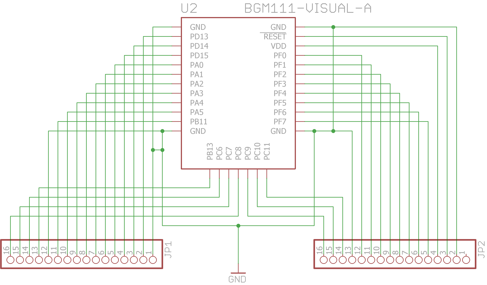

# pcb-breakout-bgm111
Pin breakout of the Silicon Labs BGM111 module to through-hole pin headers for prototyping.

##PCB Design software and addons used

1. Eagle 7.3.0: I use Standard but Light should still be able to open/modify the files.
2. BGM111 library by [jshrowberg](https://github.com/jrowberg/sf-oshw/tree/master/bluegiga/eagle) (in repo as sf-bluegiga.lbr)

##Images
None at this time

##Schematic drawings
Images are exported from Eagle at 600dpi.

##Parts required

The BGM111 module can be bought from one of the online stores like [Mouser](http://www.mouser.sg/new/Silicon-Laboratories/silabs-bgm111-module/)
